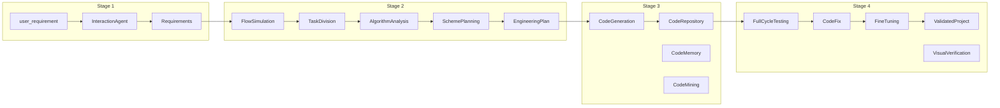

# Idea2Product

A multi-agent AI system that transforms natural language requirements into production-ready web applications through a 4-stage pipeline.

## Overview

Idea2Product takes a plain-text description of what you want to build and automatically produces a working Flask web application. The system uses 10 specialized AI agents organized in four stages:

| Stage | Purpose | Agents |
|-------|---------|--------|
| **Stage 1** | Requirements Gathering | Interaction Agent |
| **Stage 2** | Technical Planning | Task Division, Algorithm Analysis, Scheme Planning |
| **Stage 3** | Code Generation | Code Generation, Code Memory, Code Mining |
| **Stage 4** | Validation | BDD Testing, Visual Verification, Fine-tuning |

### How It Works

1. **Requirements** - The Interaction Agent clarifies your requirements through dialogue (or skips if `--no-interactive`)
2. **Planning** - Three agents break the requirement into tasks, analyze algorithms, and design the file/API structure
3. **Code Generation** - A LangChain-based agent generates code using an interface-first strategy (`.pyi` stubs -> dependency graph -> implementations)
4. **Validation** - The system runs the generated code, detects errors, and fixes them automatically in a run-fix loop. Optionally generates BDD smoke tests and runs visual verification.

---

## Quick Reproduce (3 Steps)

1. **Install** (≈2 min)

   ```bash
   git clone https://github.com/yourusername/idea2product.git
   cd idea2product
   python -m venv venv
   # Linux/Mac: source venv/bin/activate
   # Windows: venv\Scripts\activate
   pip install -r requirements.txt
   pip install -e .
   ```

2. **Configure** (≈1 min)

   ```bash
   cp .env.example .env
   # Edit .env: set OPENAI_API_KEY=sk-your-key
   ```

3. **Run** (≈1–5 min, depends on LLM)

   ```bash
   python -m src.cli create "Build a todo list app"
   ```

**Expected output**: Project saved to `data/projects/<project_id>/generated/`, runnable via `python app.py` in that directory.

---

## Prerequisites

- **Python 3.9+**
- **OpenAI API key** (GPT-4o recommended) or any OpenAI-compatible endpoint
- **Git** (optional, only needed for the Code Mining feature)

## Installation

```bash
# Clone the repository
git clone https://github.com/yourusername/idea2product.git
cd idea2product

# (Recommended) Create a virtual environment
python -m venv venv
# Linux/Mac:
source venv/bin/activate
# Windows:
venv\Scripts\activate

# Install dependencies
pip install -r requirements.txt

# Install in development mode (enables the `idea2product` CLI command)
pip install -e .
```

## Configuration

Copy the example environment file and fill in your API key:

```bash
cp .env.example .env
```

Edit `.env`:

```env
# Required
OPENAI_API_KEY=sk-your-key-here

# Optional - custom endpoint (OpenRouter, Azure, local proxy, etc.)
OPENAI_BASE_URL=https://api.openai.com/v1

# Optional - model selection
OPENAI_MODEL=gpt-4o
OPENAI_VLM_MODEL=gpt-4o
```

### Full Configuration Reference

| Variable | Default | Description |
|----------|---------|-------------|
| `OPENAI_API_KEY` | *(required)* | OpenAI API key |
| `OPENAI_BASE_URL` | `https://api.openai.com/v1` | API endpoint URL |
| `OPENAI_MODEL` | `gpt-4o` | LLM model for text generation |
| `OPENAI_VLM_MODEL` | `gpt-4o` | Vision model for UI verification |
| `MAX_TOKENS` | `4096` | Max response tokens per LLM call |
| `TEMPERATURE` | `0.7` | LLM sampling temperature (0-1) |
| `GITHUB_TOKEN` | *(optional)* | GitHub token for code mining |
| `LOG_LEVEL` | `INFO` | Logging level |
| `SANDBOX_TIMEOUT` | `30` | Timeout (seconds) for running generated code |
| `MAX_FIX_ATTEMPTS` | `2` | Max iterations in the run-fix loop |
| `ENABLE_CODE_MEMORY` | `false` | Enable code snippet memory (SQLite) |
| `ENABLE_CODE_MINING` | `false` | Enable GitHub code search |
| `ENABLE_VISUAL_VERIFICATION` | `false` | Enable GPT-4o Vision UI checks |
| `ENABLE_BDD_TESTING` | `true` | Generate and run BDD smoke tests |

### Model Registry (optional)

When `config/models_registry.json` exists, the system selects models per pipeline stage instead of using a single fixed model. The registry defines:

- **models**: `id`, `provider`, `capabilities` (text, json, vision, code, long_context), `roles` (primary, fallback, vision), `cost_tier`
- **stage_routing**: Maps each stage (1–4) and vision tasks to `preferred_role` and `required_capabilities`

If the registry is missing or empty, the system falls back to `OPENAI_MODEL` and `OPENAI_VLM_MODEL` from `.env`, matching the original behavior.

---

## Usage

### Method 1: Command Line (CLI)

**Create a project (non-interactive):**

```bash
python -m src.cli create "Build a todo list app with add, delete, and complete functionality"
```

**Create a project (interactive mode) - asks clarification questions first:**

```bash
python -m src.cli create -i "Build a todo list app"
```

**List all generated projects:**

```bash
python -m src.cli list
```

**Check project status:**

```bash
python -m src.cli status proj_20260214_142450_d87387
```

The pipeline will:
1. Analyze your requirement and (optionally) ask clarifying questions
2. Create a technical plan (tasks, file structure, API specs)
3. Generate working Python/Flask code
4. Run the code, detect errors, and fix them automatically
5. Save everything to `data/projects/<project_id>/`

### Method 2: Web UI (Chat-based Build)

Start the Flask web server:

```bash
python -m src.web.app
```

The server starts on `http://localhost:5000`. Open it in a browser to see the Build Studio UI.

The web UI provides a chat-based workflow inspired by Google AI Studio's Build feature:
- **Left panel**: Chat with the AI agent — describe what you want to build
- **Right panel**: Real-time code viewer and live preview of the generated application
- The pipeline runs automatically in the background after each message
- You can keep sending messages to refine requirements; the system incrementally updates the generated app

**API Endpoints:**

| Method | Endpoint | Description |
|--------|----------|-------------|
| `GET` | `/api/health` | Health check |
| `POST` | `/api/projects` | Create project (`{"start_chat": true}` or `{"requirement": "..."}`) |
| `GET` | `/api/projects` | List all projects |
| `GET` | `/api/projects/<id>` | Get project details |
| `GET` | `/api/projects/<id>/status` | Poll project status & progress |
| `POST` | `/api/projects/<id>/chat` | Send message & get AI reply (auto-triggers generation) |
| `GET` | `/api/projects/<id>/chat` | Get chat history |
| `GET` | `/api/projects/<id>/files` | List generated files |
| `GET` | `/api/projects/<id>/file/<path>` | Get file content |
| `GET` | `/api/projects/<id>/preview-url` | Get live preview URL |
| `DELETE` | `/api/projects/<id>` | Delete a project |
| `POST` | `/api/projects/analyze` | Analyze a requirement (legacy) |
| `POST` | `/api/projects/clarify` | Generate clarification questions (legacy) |
| `POST` | `/api/projects/finalize` | Finalize requirements with answers (legacy) |

**Example - chat-based workflow via curl:**

```bash
# 1. Create a chat project
curl -X POST http://localhost:5000/api/projects \
  -H "Content-Type: application/json" \
  -d '{"start_chat": true}'
# Response: {"project_id": "proj_20260214_161539", "status": "idle"}

# 2. Send a message (auto-triggers generation in background)
curl -X POST http://localhost:5000/api/projects/proj_20260214_161539/chat \
  -H "Content-Type: application/json" \
  -d '{"message": "Build a calculator app with add, subtract, multiply, divide"}'
# Response: {"reply": "...", "project_id": "proj_20260214_161539"}

# 3. Poll status until completed
curl http://localhost:5000/api/projects/proj_20260214_161539/status

# 4. Send follow-up to refine (incremental update)
curl -X POST http://localhost:5000/api/projects/proj_20260214_161539/chat \
  -H "Content-Type: application/json" \
  -d '{"message": "Add a history panel that shows previous calculations"}'

# 5. Get live preview URL
curl http://localhost:5000/api/projects/proj_20260214_161539/preview-url
```

**Example - legacy one-shot workflow:**

```bash
curl -X POST http://localhost:5000/api/projects \
  -H "Content-Type: application/json" \
  -d '{"requirement": "Build a calculator app"}'
```

### Method 3: Python API

```python
from config.settings import get_settings
from src.core.orchestrator import Orchestrator

settings = get_settings()
orchestrator = Orchestrator(settings)

# Run the full pipeline
result = orchestrator.run(
    "Build a blog with create, edit, delete posts and comments",
    interactive=False
)

print(f"Deployable: {result.is_deployable}")
print(f"Files: {len(result.repository.files)}")
print(f"Tests passed: {result.test_results.logic_passed}")
```

---

## Step-by-Step Reproduction

Follow this path from CLI to generated app:

1. **Run the create command**
   ```bash
   python -m src.cli create "Build a todo list app"
   ```

2. **Watch the logs** — You will see Stage 1–4 progress:
   - Stage 1: "Interaction Agent" → Requirements extracted
   - Stage 2: Flow simulation, Task division, Algorithm analysis, Scheme planning
   - Stage 3: "Code Generation" → Files written to `generated/`
   - Stage 4: Testing, Code fix, Fine-tuning, optional Visual verification

3. **Find the output** — Project is saved under:
   - `data/projects/<project_id>/artifacts/` — JSON artifacts (requirements, plan, context)
   - `data/projects/<project_id>/generated/` — Runnable Flask app

4. **Verify**
   ```bash
   cd data/projects/<project_id>/generated
   pip install -r requirements.txt
   python app.py
   ```
   Open `http://localhost:5000` in your browser.

---

## Running Generated Applications

After generation, your application is saved under `data/projects/<project_id>/generated/`. To run it:

```bash
cd data/projects/<project_id>/generated

# Install generated app's dependencies (if requirements.txt exists)
pip install -r requirements.txt

# Run the Flask app
python app.py
# or
python -m flask run
```

The generated app typically runs on `http://localhost:5000`.

---

## Project Output Structure

Each generated project is stored with all intermediate artifacts:

```
data/projects/<project_id>/
├── artifacts/
│   ├── 01_requirements.json      # Parsed requirements
│   ├── 02_engineering_plan.json   # Technical plan
│   ├── 03_code_repository.json   # Generated code metadata
│   ├── 04_validated_project.json  # Test results & validation
│   ├── chat.json                 # Chat conversation history
│   └── context.json              # Full execution context
├── generated/                     # The actual application code
│   ├── app.py                    # Entry point
│   ├── app/
│   │   ├── __init__.py
│   │   ├── models/
│   │   └── routes/
│   ├── config.py
│   ├── templates/
│   ├── requirements.txt
│   └── tests/
└── logs/                          # Execution logs
```

---

## Development

### Running Tests

Unit tests use mocked LLM services and require no API key:

```bash
pytest tests/ -v
```

### Running Benchmarks

The benchmark suite runs the full pipeline on a few sample tasks (requires a valid `OPENAI_API_KEY`):

```bash
python -m src.benchmarks.run_small_suite
```

Results are saved to `data/benchmark_report.json`.

### Code Quality

```bash
black src/ tests/         # Format code
ruff check src/ tests/    # Lint
mypy src/                 # Type checking
```

---

## Architecture Details

### Agent Mapping (plan.txt alignment)

| Stage | Agent | plan.txt | Input | Output | Key File |
|-------|-------|----------|-------|--------|----------|
| 1 | InteractionAgent | 交互智能体 | user_requirement | Requirements | `interaction_agent.py` |
| 2 | FlowSimulationAgent | (流程模拟) | Requirements | flow_simulation | `planning_agents.py` |
| 2 | TaskDivisionAgent | 任务拆解智能体 | Requirements, flow | List[Task] | `planning_agents.py` |
| 2 | AlgorithmAnalysisAgent | 算法解析智能体 | Tasks | algorithms | `planning_agents.py` |
| 2 | SchemePlanningAgent | 方案规划智能体 | Requirements, tasks, flow | file_structure, api_specs, pyi_stubs | `planning_agents.py` |
| 3 | CodeGenerationAgent | 代码生成智能体 | EngineeringPlan | CodeRepository | `code_generation_agents.py` |
| 3 | CodeMemoryAgent | 代码记忆智能体 | Context, repository | (side effect) symbol_table | `code_generation_agents.py` |
| 3 | CodeMiningAgent | 代码挖掘智能体 | Context | (injected into gen) | `code_generation_agents.py` |
| 4 | FullCycleTestingAgent | 全链路测试智能体 | Context | TestResult | `validation_agents.py` |
| 4 | CodeFixAgent | (run-fix loop) | generated path | (disk changes) | `validation_agents.py` |
| 4 | FrontendTestingAgent | (API tests) | generated path | frontend_errors | `validation_agents.py` |
| 4 | FineTuningAgent | 微调优化智能体 | Context, TestResult | fixed repository | `validation_agents.py` |
| 4 | VisualVerificationAgent | 视觉验收 | Context | alignment_score, issues | `validation_agents.py` |

### Data Flow



### Pipeline Stages

**Stage 1 - Requirements Gathering**

The `InteractionAgent` analyzes the user's natural language input, optionally asks clarification questions, and produces a structured `Requirements` object with title, description, features, constraints, and data requirements. In chat mode, the agent also supports multi-turn conversation (`reply_in_chat`), extracting requirements from conversations (`conversation_to_requirements`), and merging incremental updates (`merge_requirements`).

**Stage 2 - Technical Planning**

- `FlowSimulationAgent` - Simulates user interaction flow
- `TaskDivisionAgent` - Breaks requirements into typed tasks (frontend, backend, database, etc.)
- `AlgorithmAnalysisAgent` - Identifies algorithms, data structures, and library dependencies
- `SchemePlanningAgent` - Designs file structure, interface specifications, and API schemas

**Stage 3 - Code Generation**

The `CodeGenerationAgent` uses a LangChain agent with file-system tools to generate code. Key features:
- **Interface-first strategy**: generates `.pyi` stub files first, builds a dependency graph, then generates implementations that respect the interfaces
- **Code skeleton injection**: the `CodeSkeleton` (built from `.pyi` stubs via `skeleton_builder.py`) is serialized into the LLM prompt so the model follows the designed architecture
- **Code Memory** (optional): saves generated code snippets to SQLite for future reuse
- **Code Mining** (optional): fetches relevant code from GitHub for reference

**Stage 4 - Validation**

- `FullCycleTestingAgent` - Saves generated files, runs syntax checks, executes the app, and performs a run-fix loop (up to 5 iterations)
- `FineTuningAgent` - If errors persist after the run-fix loop, applies targeted repairs (syntax, imports, entry points)
- `VisualVerificationAgent` (optional) - Uses GPT-4o Vision to verify UI rendering
- BDD smoke tests are optionally generated and executed via pytest

### Key Technical Decisions

- **LLM Service**: All LLM interactions go through `src/services/llm_service.py`. Use `LLMService.from_settings(settings)` to create instances.
- **Settings**: Pydantic-settings based configuration in `config/settings.py`, loaded from `.env`.
- **Templates**: A Flask base template (`templates/flask_base/`) bootstraps generated projects.
- **Data Models**: All pipeline data types are Pydantic models in `src/core/data_models.py`.
- **Chat Service**: `src/web/services/chat_service.py` persists per-project conversations to `artifacts/chat.json`.
- **Preview Service**: `src/web/services/preview_service.py` manages subprocesses running generated apps for live preview.
- **Task Service**: `src/web/services/task_service.py` handles background generation with per-project serialization.

---

## Using Custom API Providers

Idea2Product works with any OpenAI-compatible API. Examples:

```env
# OpenRouter
OPENAI_BASE_URL=https://openrouter.ai/api/v1
OPENAI_API_KEY=sk-or-xxxxx

# Azure OpenAI
OPENAI_BASE_URL=https://your-resource.openai.azure.com/
OPENAI_API_KEY=your-azure-key

# Local (e.g. vLLM, text-generation-inference)
OPENAI_BASE_URL=http://localhost:8000/v1
OPENAI_API_KEY=dummy
```

---

## Deploy as Public Website

Deploy Idea2Product so anyone can use Build Studio in a browser.

### Render (recommended, free tier)

1. Go to [render.com](https://render.com) and sign in with GitHub.
2. Click **New** → **Web Service**.
3. Connect your repository (`idea2product`).
4. Render reads `render.yaml`; ensure **Build Command** and **Start Command** match (or leave defaults).
5. Add **Environment Variable**: `OPENAI_API_KEY` = your API key.
6. Click **Create Web Service**. After deploy, you get a URL like `https://idea2product-xxx.onrender.com`.

**Note**: Free tier sleeps after 15 minutes of no traffic; the first request after sleep may take ~1 minute to wake.

### Railway

1. Go to [railway.app](https://railway.app) and sign in with GitHub.
2. **New Project** → **Deploy from GitHub repo** → select `idea2product`.
3. Railway uses the `Procfile`; no extra config needed.
4. **Variables** → add `OPENAI_API_KEY`.
5. Deploy; Railway assigns a public URL.

### Important for public deployment

- Set `OPENAI_API_KEY` as an environment variable (never commit it).
- Free tiers usually have ephemeral disk: generated projects may be lost on restart.
- The `gunicorn --timeout 300` in `render.yaml` / `Procfile` helps avoid timeouts during long code generation.

---

## Reproducibility Checklist

| Before running | After running |
|----------------|---------------|
| Python 3.9+ installed | `data/projects/<id>/generated/` exists |
| `.env` exists and `OPENAI_API_KEY` is set | `python app.py` starts the generated app |
| Network can reach OpenAI (or custom base_url) | `pytest tests/ -v` passes |

---

## Troubleshooting

### API Errors

- **401 Unauthorized** - Check your `OPENAI_API_KEY` in `.env`
- **Rate limit exceeded** - Switch to a provider with higher rate limits or add retry delays
- **Connection refused** - Verify `OPENAI_BASE_URL` is correct and the service is running

### Generation Issues

- **Empty generated code** - Try a more detailed requirement description
- **Tests failing after generation** - The system attempts automatic fixes; check the logs in `data/projects/<id>/logs/`
- **Import errors in generated app** - Run `pip install -r requirements.txt` in the generated app's directory

### Common Pitfalls

- Make sure `.env` exists and has a valid `OPENAI_API_KEY` before running any command
- On Windows, if you see encoding errors, the CLI automatically handles UTF-8 encoding
- The `data/` directory can grow large over time; delete old projects with `python -m src.cli list` to find them

### Reproduction Failures

- **`ModuleNotFoundError: No module named 'src'`** — Run `pip install -e .` from the project root so the package is installed in editable mode
- **`401 Unauthorized`** — `.env` is missing or `OPENAI_API_KEY` is invalid. Ensure you copied `.env.example` to `.env` and set a valid key
- **Empty or minimal generated code** — Use a more specific requirement (e.g. "Build a todo app with add, delete, and complete" instead of "Build an app")
- **Tests fail with `pytest tests/`** — Ensure you are in the project root and have run `pip install -r requirements.txt`; unit tests use mocks and do not need an API key

---

## License

MIT License
