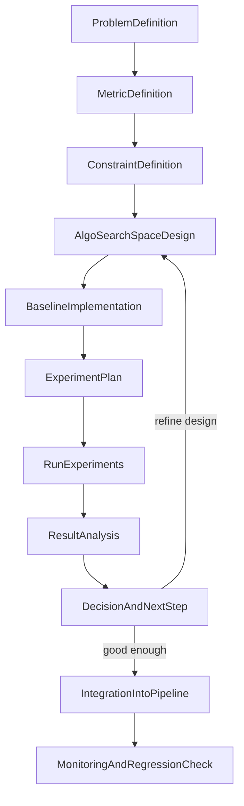

## Algorithm / Model 设计优化全流程

本文件将计划中的“算法/模型设计优化全流程”落地到 Idea2Product 项目，说明如何在现有 4 阶段 pipeline 与基准评测工具上执行一套可重复的优化循环。**本文件仅覆盖设计与评估流程本身，不直接规定任何代码或配置改动；当你决定真正修改 `src/agents/**` 或 `src/services/**` 时，请按 doc-sync 规则单独规划实现方案。**

典型适用场景包括：
- 提升自动生成应用的测试通过率 / 可部署率
- 降低生成无用文件的比例
- 优化 LLM 模型与参数（温度、top_p 等）的选择策略

你可以将本文件视作“算法/模型优化工作说明书”，先在这里完成问题定义、指标与实验设计，然后再进入具体实现阶段。

---

## 0. 应用范围与问题描述模板

在开始一次新的优化循环前，建议先按以下模板写清楚“要优化什么”：

```markdown
### 优化任务名称

- 背景 / 现象：
  - （例）在 Todo/Calculator/Weather 任务上，`test_passed` 低于 0.6，常见错误为依赖安装失败与逻辑错误。
- 主要优化目标（主指标）：
  - （例）将 `test_passed` 提升到 ≥ 0.8。
- 辅助指标：
  - （例）`errors_count`、`fix_attempts`、`code_quality_score`。
- 任务范围：
  - 使用哪些 benchmark 任务（如 small/full），是否包含自定义任务。
- 约束条件：
  - 调用成本、运行时间上限，是否允许修改 Agent 逻辑或仅能调参。
```

---

## 1. 总体流程（概览）



---

## 2. 与 4 阶段 Pipeline 的映射

结合 `[ARCHITECTURE.md](ARCHITECTURE.md)` 中的 4 阶段架构：

- **Stage 1 – Requirements**
  - 将用户自然语言需求 + 运行问题，抽象成“算法问题描述”。
  - 示例：  
    - 当前 Todo/Calculator/Weather 任务中，哪些失败模式归因于“模型选择不佳”或“任务划分不合理”。
- **Stage 2 – Planning (AlgorithmAnalysisAgent, SchemePlanningAgent)**
  - 承载步骤 1–4：问题定义、指标与约束、搜索空间设计、基线方案。
  - 建议在 `AlgorithmAnalysisAgent` 的输出中，显式记录：候选算法类型、关键可调参数、依赖的服务。
- **Stage 3 – Code Generation (CodeGenerationAgent)**
  - 落地步骤 3 & 7：将选中的算法策略实现为可配置的代码组件（策略类 / 函数），并在 `config/settings.py` / `config/models_registry.json` 中暴露关键参数。
- **Stage 4 – Validation (FullCycleTestingAgent, FineTuningAgent, VisualVerificationAgent)**
  - 支撑步骤 5–8：通过 `run_small_suite` 等基准脚本批量运行，收集 `TestResult` 与派生指标（`code_quality_score`、`security_score`、`alignment_score` 等），用于结果分析与回归检查。

---

## 3. 步骤详解与在仓库中的落点

### 3.1 问题与指标定义（ProblemDefinition + MetricDefinition）

- **问题定义**（在哪里写）：
  - 推荐在 `docs/BUG_REPORT.md`、`docs/bug_check_report_latest.md` 或新的实验记录文档中，用自然语言描述：
    - 目标任务集合（如：Todo/Calculator/Weather，或自定义任务）
    - 主要失败模式（如：测试未通过、部署失败、无用文件过多）
    - 假设的原因（模型选择错误、任务划分不好、提示模板不足等）
- **指标选择**（参考 `[BENCHMARK.md](BENCHMARK.md)`）：
  - 直接复用 `data/benchmark_report.json` 中已有字段，例如：
    - `success`、`is_deployable`、`test_passed`、`errors_count`
    - `code_quality_score`、`security_score`、`alignment_score`
    - `duration_seconds`、`fix_attempts`、`pass_at_k_value`
  - 可以为某次优化任务选择 2–3 个主指标 + 若干辅助指标。

### 3.2 约束与搜索空间（ConstraintDefinition + AlgoSearchSpaceDesign）

- **现实约束**（建议在问题说明中写清）：
  - 每次实验允许的 LLM 调用次数 / 成本上限
  - 单次 pipeline 运行允许的时长
  - 是否允许修改提示模板、Agent 逻辑，还是仅能调参数
- **搜索空间设计**：
  - 典型可以调的维度包括：
    - LLM 模型与温度 / top_p（见 `config/models_registry.json` 与 `config/settings.py`）
    - Stage 2 中任务划分、算法分析的详细程度（如 Task 数量上限、复杂度估计阈值）
    - Stage 4 中 FineTuning 的最大修复回合数、是否启用 VisualVerification 等。
  - 在文档中列出“本轮实验要探索的参数表”，例如：

```markdown
| 名称 | 维度 | 取值 |
|------|------|------|
| 模型温度 | codegen_temperature | [0.1, 0.3, 0.7] |
| Pass@k | pass_at_k | [1, 3] |
| 修复回合 | max_fix_attempts | [1, 3] |
```

### 3.3 基线方案实现（BaselineImplementation）

- **基线来源**：
  - 可以直接使用当前 `python -m src.benchmarks.run_baseline` 的配置，作为“无 CodeMemory/Mining/BDD/Visual 的最简方案”。
  - 或使用 `run_small_suite` 默认配置（参见 `[BENCHMARK.md](BENCHMARK.md)`）。
- **实现形式**：
  - 在配置层：通过 `--config`、环境变量或 `config/settings.py` 中的标志位，明确定义“baseline 配置”。
  - 在文档层：在本文件或专门的实验记录中，记录 baseline 的关键信息（模型、参数、Agent 是否启用等）。

### 3.4 实验计划与样本集（ExperimentPlan）

- **选择任务集**：
  - 直接使用 `run_small_suite` 的 `small` / `full` 任务集，或编写自定义任务列表。
- **实验矩阵**：
  - 组合 baseline + 若干候选配置，形成一个小矩阵，每个单元格是一组“算法/参数设定”。
  - 为每个配置约定运行次数（例如 `--runs 3`）以估计稳定性（均值 ± 方差）。
- **记录约定**：
  - 约定统一的结果输出位置（如 `data/experiments/<experiment_name>/report.json`），方便对比。

### 3.5 运行实验与记录（RunExperiments）

- **推荐入口**：`python -m src.benchmarks.run_small_suite`（详见 `[BENCHMARK.md](BENCHMARK.md)`）。
  - 使用不同的参数 / 配置运行多次，将输出 JSON 报告归档到按实验命名的目录。
- **可选脚本**：
  - 若需要批量化实验，可以在 `scripts/` 下新增一个小脚本（例如 `scripts/run_algo_experiments.py`），封装多组命令并自动整理输出路径。

### 3.6 结果分析与决策（ResultAnalysis + DecisionAndNextStep）

- **分析方式**：
  - 对比每个配置下的核心指标（如 `test_passed` 比例、`code_quality_score` 均值等）。
  - 重点查看失败样本的错误类型与堆栈，以区分“系统性问题”与“偶发噪声”。
- **决策输出**：
  - 为每轮实验写一段简要结论，包括：
    - 哪个配置相对最佳、为什么
    - 是否需要进一步细化搜索空间，或改用更复杂的算法
  - 可以追加到 `docs/bug_check_report_latest.md` 或新建 `docs/ALGO_EXPERIMENT_LOG.md`。

### 3.7 集成到 Pipeline（IntegrationIntoPipeline）

- **代码层面（待选动作）**：
  - 将选定的策略以以下形式集成：
    - 在 `src/agents/stage2_planning/` 中，将新算法策略封装成可替换的函数或类。
    - 在 `src/services/` 层（如 `llm_service.py` 或模型选择相关服务）追加可配置的选择逻辑。
  - 通过 `config/settings.py` 或其他配置文件暴露这些策略的开关和参数。
- **文档层面**：
  - 当实际修改 Agent 或 Service 时，根据 `doc-sync` 规则，更新：
    - `docs/refs/AGENTS_REF.md`
    - `docs/refs/SERVICES_REF.md`
    - 以及 `docs/CHANGELOG.md` 中的对应条目。

### 3.8 监控与回归检查（MonitoringAndRegressionCheck）

- **周期性回归**：
  - 保留一组固定任务集（如 `run_small_suite --tasks small`），作为“烟雾测试 + 回归用例”。
  - 每次对算法/模型策略进行变更后，至少运行一次该套测试，并记录结果。
- **健康指标**：
  - 定期关注 `data/benchmark_report.json` 中的关键汇总字段（成功率、平均错误数、平均修复回合数等）。
  - 如发现明显退化，回滚到上一个稳定配置，并重新启动一次小规模优化循环。

---

## 4. 下一步可选落地方向（起手问题与使用方式）

当你准备从“流程”走向“具体改造”时，可以从以下子问题中选择一个作为起点：

1. **提升测试通过率 / 可部署率**
   - 建议命令：
     - `python -m src.benchmarks.run_small_suite --runs 3`
     - `python -m src.benchmarks.run_baseline`
   - 重点指标字段：`test_passed`、`is_deployable`、`errors_count`、`fix_attempts`。
   - 建议在实验记录中写明：每个配置对应的模型/温度/修复回合数，以及失败样本的典型错误类型。
2. **减少无用文件与冗余代码**
   - 建议命令：同上，或在需要时扩展到 `--tasks full`。
   - 重点指标字段：`files_count`、`code_quality_score`、`duration_seconds`。
   - 建议在实验记录中补充：典型冗余文件路径、是否可以通过 SchemePlanning 或 CodeGeneration 的策略调整减小文件数。
3. **优化 LLM 模型与参数选择策略**
   - 建议命令：基于不同模型/温度配置，多次运行 `run_small_suite`；可结合 `--config` 预设。
   - 重点指标字段：`success`、`duration_seconds`、`code_quality_score`，以及（如有记录）token 成本。
   - 建议在实验记录中枚举：每种模型/参数组合的优劣与适用场景，为后续在模型路由/配置中固化策略提供依据。

每个方向都可以严格按照本文件的 8 步骤执行，并通过现有的 benchmark 脚本形成“可复制的实验 + 清晰的决策记录”。

---

## 5. 未来扩展与 doc-sync 提醒

当你基于本流程确认某一条算法/模型设计路线值得长期采用，并准备真正修改代码时，建议：

- 代码层面：在 `src/agents/**`、`src/services/**` 或 `config/**` 中实现相应策略与配置。
- 文档层面：按照 `doc-sync` 规则同步更新：
  - `docs/refs/AGENTS_REF.md`（若新增/修改 Agent 行为或输入输出）。
  - `docs/refs/SERVICES_REF.md`（若修改 LLMService/ModelSelector 等服务层）。
  - `docs/refs/WEB_FLOW_REF.md`（若影响 Web/API 流程）。
  - `docs/CHANGELOG.md`（追加一行说明本次改动与影响范围）。

本文件本身不要求你立刻做这些改动，而是为后续的代码级优化提供一套可重复的“前置设计与评估”流程。

