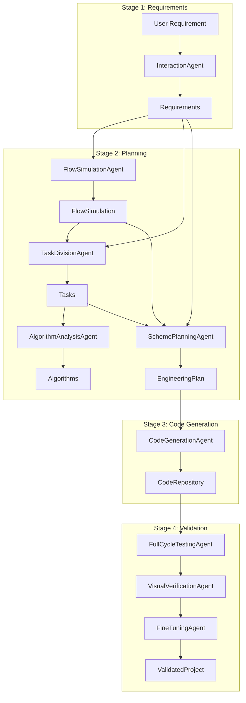

# Idea2Product Architecture

## Pipeline Overview

Idea2Product uses a 4-stage pipeline with 10 specialized agents to transform natural language requirements into production-ready Flask web applications.

## Data Flow

| Stage | Input | Output |
|-------|-------|--------|
| 1 | User requirement (string) | Requirements (title, features, constraints) |
| 2 | Requirements, FlowSimulation | EngineeringPlan (tasks, algorithms, file_structure, api_specs, pyi_stubs) |
| 3 | EngineeringPlan, Requirements | CodeRepository (files, structure, dependencies) |
| 4 | CodeRepository | ValidatedProject (status, deployed path, test results) |

## Key Components

### Core

- **Orchestrator** (`src/core/orchestrator.py`): Coordinates all stages, manages ExecutionContext, model routing
- **ExecutionContext** (`src/core/context.py`): Carries state (requirements, plan, repository) through the pipeline
- **Data Models** (`src/core/data_models.py`): Requirements, Task, Algorithm, EngineeringPlan, CodeRepository, ValidatedProject

### Agents

| Stage | Agent | Purpose |
|-------|-------|---------|
| 1 | InteractionAgent | Extracts/refines requirements via dialogue or one-shot |
| 2 | FlowSimulationAgent | Simulates user operation flow |
| 2 | TaskDivisionAgent | Splits requirements into atomic tasks (DAG) |
| 2 | AlgorithmAnalysisAgent | Defines implementation approach per task |
| 2 | SchemePlanningAgent | Produces file structure, API specs, pyi stubs |
| 3 | CodeGenerationAgent | Generates code via LangChain Agent (interface-first) |
| 4 | FullCycleTestingAgent | BDD tests, run-fix loop |
| 4 | VisualVerificationAgent | Screenshot-based verification |
| 4 | FineTuningAgent | Iterative bug fixing |

### Services

- **LLMService**: OpenAI-compatible API, retries, streaming
- **ModelSelector**: Stage-based model routing (primary/fallback)
- **HfModelService**: Hugging Face model search for ML tasks
- **CodeMemoryService**: SQLite knowledge graph (optional)
- **CodeMiningService**: GitHub code retrieval (optional)

## Interface-First Strategy (Stage 3)

1. Build `.pyi` stubs from SchemePlanning output
2. Construct dependency graph
3. Generate implementations in dependency order
4. Each task uses tools (list_files, read_file, write_file, modify_file) to produce code

## Configuration

- **Settings** (`config/settings.py`): Pydantic-settings, env vars, feature flags
- **Prompts** (`config/prompts/`): Template files for each agent
- **Models** (`config/models_registry.json`): Model routing by stage
