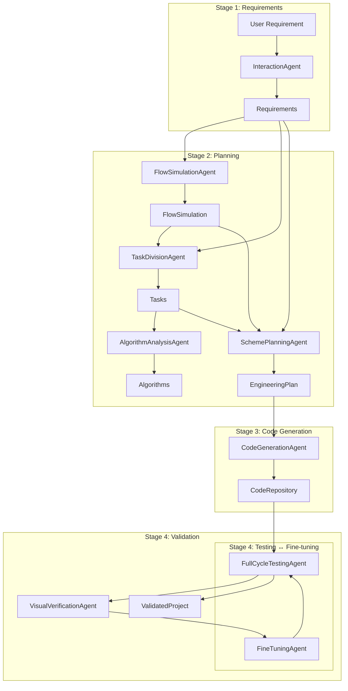
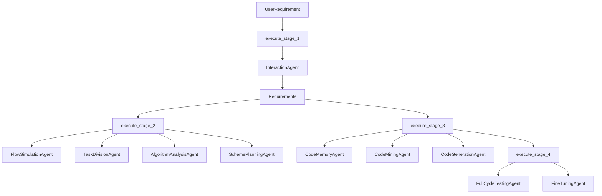

# Idea2Product Architecture

## Pipeline Overview

Idea2Product uses a 4-stage pipeline with 10+ specialized agents to transform natural language requirements into production-ready outputs. Supported **product types** (Requirements.product_type): web (default), pdf, video, audio, app. For web/app, Stage 2 produces the full EngineeringPlan (file_structure, pyi_stubs, etc.); for pdf/video/audio, Stage 2 produces type-specific specs (latex_specs, video_specs, audio_specs) via media planning agents. Model selection can be routed by **product_type** (config/models_registry.json product_type_routing) and overridden by user-selected **model_id** (API and ExecutionContext).

## Data Flow

| Stage | Input | Output |
|-------|-------|--------|
| 1 | User requirement (string) | Requirements (title, features, constraints) |
| 2 | Requirements, FlowSimulation | EngineeringPlan (tasks, algorithms, file_structure, api_specs, pyi_stubs) |
| 3 | EngineeringPlan, Requirements | CodeRepository (files, structure, dependencies) |
| 4 | CodeRepository | ValidatedProject (status, deployed path, test results) |

## Key Components

### Core

- **Orchestrator** (`src/core/orchestrator.py`): Coordinates all stages, manages ExecutionContext, model routing
- **ExecutionContext** (`src/core/context.py`): Carries state (requirements, plan, repository) through the pipeline
- **Data Models** (`src/core/data_models.py`): Requirements, Task, Algorithm, EngineeringPlan, CodeRepository, ValidatedProject

### Agents

| Stage | Agent | Purpose |
|-------|-------|---------|
| 1 | InteractionAgent | Extracts/refines requirements via dialogue or one-shot |
| 2 | FlowSimulationAgent | Simulates user operation flow |
| 2 | TaskDivisionAgent | Splits requirements into atomic tasks (DAG) |
| 2 | AlgorithmAnalysisAgent | Defines implementation approach per task |
| 2 | SchemePlanningAgent | Produces file structure, API specs, pyi stubs |
| 3 | CodeGenerationAgent | Generates code via LangChain Agent (interface-first) |
| 4 | FullCycleTestingAgent | BDD tests, run-fix loop |
| 4 | VisualVerificationAgent | Screenshot-based verification |
| 4 | FineTuningAgent | Iterative bug fixing |

### Services

- **LLMService**: OpenAI-compatible API, retries, streaming
- **ModelSelector**: Stage-based model routing (primary/fallback)
- **HfModelService**: Hugging Face model search for ML tasks
- **CodeMemoryService**: SQLite knowledge graph (optional)
- **CodeMiningService**: GitHub code retrieval (optional)

## Interface-First Strategy (Stage 3)

1. Build `.pyi` stubs from SchemePlanning output
2. Construct dependency graph
3. Generate implementations in dependency order
4. Each task uses tools (list_files, read_file, write_file, modify_file) to produce code

## Algorithm / Model 优化与 Pipeline 的关系

Idea2Product 的算法/模型设计优化遵循一个独立但紧密耦合的循环（问题定义 → 指标与约束 → 搜索空间 → 基线方案 → 实验 → 集成 → 回归），详细见 `[ALGO_OPTIMIZATION_FLOW.md](ALGO_OPTIMIZATION_FLOW.md)`。

与 4 阶段的对应关系大致为：

- **Stage 1 Requirements**：将用户需求和当前失败模式抽象为“可优化的算法问题”（例如：模型选择策略、任务划分策略等）。
- **Stage 2 Planning**（尤其是 `AlgorithmAnalysisAgent` 与 `SchemePlanningAgent`）：承载算法搜索空间设计与基线方案选择。
- **Stage 3 Code Generation**：将选定的算法策略实现为可配置的代码（接口优先，实现可替换）。
- **Stage 4 Validation**：通过 `FullCycleTestingAgent`、`FineTuningAgent`、`VisualVerificationAgent` 以及 benchmark 脚本收集指标并驱动下一个优化循环。

## Configuration

- **Settings** (`config/settings.py`): Pydantic-settings, env vars, feature flags
- **Prompts** (`config/prompts/`): Template files for each agent
- **Models** (`config/models_registry.json`): Model routing by stage

### Frontend UI Note

The Idea2Product web UI uses a **Bento Grid** style layout in the chat welcome area to present core capabilities as cards with contrasting sizes but unified radius and spacing. Stage 2/3 frontend design guidelines reuse this pattern for generated apps that need a feature overview or dashboard-style home page.

## Orchestrator ↔ Agent 调用关系（代码视图）

