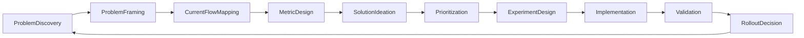

# Idea2Product 设计优化全流程

## 1. 背景与目标

Idea2Product 已有稳定的 4 阶段流水线：

- Stage 1: Requirements — 需求澄清与结构化（InteractionAgent）
- Stage 2: Planning — 任务拆分、算法分析、工程方案（FlowSimulation/TaskDivision/AlgorithmAnalysis/SchemePlanning）
- Stage 3: Code Generation — 接口优先的代码生成（CodeGeneration + 可选 CodeMemory/CodeMining）
- Stage 4: Validation — 全流程测试与修复（FullCycleTesting/FineTuning/VisualVerification）

本文件给出一条可重复执行的「设计优化全流程」，用于系统化地改进这条流水线本身：

- **统一**：如何发现问题、提出改进方案、设计实验并评估效果
- **端到端**：从需求输入体验到生成结果质量的整体视角
- **可落地**：直接映射到 Agent、Prompt、数据模型、Web 流程与服务层的具体改动

---

## 2. 全局优化流程总览

高层优化循环如下：



- **ProblemDiscovery**: 从用户反馈、运行日志、benchmark、内部体验中收集痛点
- **ProblemFraming**: 把模糊痛点收敛成「单点可优化问题」
- **CurrentFlowMapping**: 用架构图和数据流把当前 Stage1–4 的实际行为画清楚
- **MetricDesign**: 定义可量化的评估指标（成功率、交互轮数、错误率等）
- **SolutionIdeation & Prioritization**: 头脑风暴优化方案并按影响/成本排序
- **ExperimentDesign**: 设计 A/B 或前后对比实验计划
- **Implementation**: 落实到具体代码 / Prompt / 配置变更
- **Validation & RolloutDecision**: 用指标 + 主观评审判断是否推广、回滚或迭代

---

## 3. 与 4 阶段流水线的映射

### 3.1 阶段–优化触点总览

| Stage | 主要实体 | 典型优化切入点 |
|-------|----------|----------------|
| Stage 1 Requirements | `InteractionAgent`, `Requirements` | 需求澄清策略、问题设计、设计模式提取（design_mode） |
| Stage 2 Planning | Task/Algorithm/EngineeringPlan | 任务拆分质量、算法选择、文件/接口规划、外部模型集成 |
| Stage 3 Code Generation | CodeRepository, CodeSkeleton | 生成代码质量、接口优先约束执行、模型选型与并行策略 |
| Stage 4 Validation | TestResult, ValidationRun, ValidatedProject | 测试覆盖度、错误分类与修复路径、可视化验证体验 |

从发现一个具体问题开始，应先确认它主要属在哪个 Stage（可多选），再沿用本文件的优化步骤。

### 3.2 文档与代码映射

- **架构与数据流**：`docs/ARCHITECTURE.md`、`docs/refs/DATA_MODELS_REF.md`
- **Agent 行为与输入输出**：`docs/refs/AGENTS_REF.md`
- **Web/API & UX 流程**：`docs/refs/WEB_FLOW_REF.md`
- **提示模板与设计模式**：`docs/refs/PROMPTS_REF.md`
- **服务层与模型选择**：`docs/refs/SERVICES_REF.md`

在执行「现状建模（CurrentFlowMapping）」时，应优先查阅以上文档，并在本文件的模板基础上补充与本次优化相关的子流程图。

---

## 4. 具体执行步骤

### 4.1 问题发现与归档（ProblemDiscovery & Framing）

- **输入来源**
  - CLI 使用体验（`src.cli`）
  - Web 端 chat/preview/task 使用体验（`src/web/**`）
  - 生成应用的运行/测试结果（Stage 4 artifacts）
  - Benchmark 与回归测试（`docs/BENCHMARK.md`、`src/benchmarks/**`）

- **动作**
  - 使用「问题模板」（见第 5 章）记录每一次观察到的问题
  - 为每个问题标注：
    - 所属 Stage（1/2/3/4，可多选）
    - 可能涉及模块（agents / prompts / web / services / data-models）
  - 所有新问题先进入「候选优化项」列表，不直接进入开发队列

### 4.2 现状建模（CurrentFlowMapping）

- **目标**：从用户输入到观察到的问题之间，画出一条精简但准确的子流程。
- **建议做法**
  - 基于 `docs/ARCHITECTURE.md` 与 refs 文档，画出与该问题相关的 mermaid 子图：
    - 涉及哪些 Agent（例如 Stage 2 的 TaskDivision / SchemePlanning）
    - 进出哪些数据模型（Requirements → EngineeringPlan → CodeRepository → ValidatedProject）
    - 触发了哪些 Web API（chat、preview、task 等）
  - 将子流程图连同问题记录追加到：
    - `docs/DEVELOPMENT_PLAN.md` 对应章节，或
    - 单独的优化专题文档（例如 `docs/optimization/stage2_planning_quality.md`）

### 4.3 指标与目标设计（MetricDesign）

- **通用指标库**（按需选用）
  - 交互体验：平均 Q&A 轮数、平均响应时间
  - 生成质量：成功生成可运行应用比例、自动测试通过率、关键错误数量
  - 流程效率：从 create 到可用 app 的时间、中间人工干预次数

- **每个优化主题应至少包含**
  - 1–3 个核心指标
  - 1 个清晰的目标（例如：Stage 2 规划失败率从 20% 降到 10%）

### 4.4 方案构思与优先级（SolutionIdeation & Prioritization）

- **方案来源**
  - 修改/新增 Agent 逻辑（`src/agents/**`）
  - Prompt 优化（`config/prompts/**`）
  - 数据模型补充字段或结构调整（`src/core/data_models.py`）
  - Web 流程与交互改造（`src/web/**`）
  - 服务层策略调整（`src/services/**`，如模型选择、缓存/CodeMemory 行为）

- **优先级评估维度**
  - Impact（影响）：覆盖用户数、对指标的预期提升
  - Effort（成本）：涉及模块数量、实现与测试复杂度
  - Risk（风险）：对当前稳定路径的破坏可能

### 4.5 实验设计（ExperimentDesign）

- **实验类型**
  - A/B：同时保留旧流程和新流程，按请求随机或按项目分组路由（需要后续实现路由控制）
  - 前后对比：在同一套基准需求集合上，先跑旧版本，再跑新版本

- **规范建议**
  - 维护一个固定的「基准需求集合」（例如 10–20 条典型自然语言需求）
  - 使用脚本自动跑通 create → validate（可基于 `src.benchmarks` 拓展）
  - 每次实验必须记录：提交版本号、配置、指标结果与简要总结（可使用第 5 章的实验模板）

### 4.6 实施与文档挂钩（Implementation）

当某个优化方案进入实施阶段时，除了代码本身，还需要同步更新文档体系（详见 `.cursor/rules/doc-sync.mdc`）：

- 若修改了 `src/agents/**`：
  - 更新 `docs/refs/AGENTS_REF.md`
  - 在 `docs/CHANGELOG.md` 追加 scope=agents
- 若修改了 `src/core/data_models.py`：
  - 更新 `docs/refs/DATA_MODELS_REF.md`
  - 在 `docs/CHANGELOG.md` 追加 scope=data-models
- 若修改了 `src/web/**`：
  - 更新 `docs/refs/WEB_FLOW_REF.md`
  - 在 `docs/CHANGELOG.md` 追加 scope=web
- 若修改了 `config/prompts/**`：
  - 更新 `docs/refs/PROMPTS_REF.md`
  - 在 `docs/CHANGELOG.md` 追加 scope=prompts
- 若修改了 `src/services/**`：
  - 更新 `docs/refs/SERVICES_REF.md`
  - 在 `docs/CHANGELOG.md` 追加 scope=services

### 4.7 验证与回滚决策（Validation & RolloutDecision）

- **验证**：按实验设计运行实验脚本或手动流程，对比预设指标
- **决策**：
  - 指标明显改善且无重大副作用 → 记为「稳定优化」，并更新相关文档为新基线
  - 效果不确定或波动较大 → 保留为「候选方案」，不默认启用
  - 明显退化 → 快速回滚，记录经验教训

---

## 5. 模板

### 5.1 问题模板（Problem Record）

用于在 `docs/DEVELOPMENT_PLAN.md` 或单独优化文档中记录每个待优化问题：

```markdown
## 问题标题（简要概括）

- **发现日期**：YYYY-MM-DD
- **提出人**：@who
- **所属 Stage**：Stage 1 / Stage 2 / Stage 3 / Stage 4（可多选）
- **涉及模块**：agents / prompts / web / services / data-models / other

### 背景场景

- 用户目标：
- 典型输入示例：
- 期望行为：
- 实际行为：

### 初步分析 / 备注

- 已知相关 issue / 日志：
- 初步怀疑的原因：
```

### 5.2 实验记录模板（Experiment Record）

用于跟踪某个优化方案对应的实验过程与结果：

```markdown
## 实验名称：XXXX

- **优化主题**：链接到对应的问题记录
- **实验日期**：YYYY-MM-DD
- **相关提交**：commit hash / PR 链接
- **实验类型**：A/B / 前后对比

### 实验配置

- 基准需求集合：
  - 列表文件路径（如 `benchmarks/baseline_requirements.json`）
- 环境与参数：
  - LLM provider / model：
  - 关键 feature flag（如 enable_stage2_web_search 等）：

### 指标设计

- 核心指标：
  - 指标 1：
  - 指标 2（可选）：

### 实验结果

- 数据摘要：
  - 旧版本：
  - 新版本：
- 结论：
  - 是否达到预期目标：
  - 是否发现新的副作用：

### 决策与后续动作

- 决策：推广 / 保留为候选 / 回滚
- 后续动作：
  - [ ] 同步更新相关文档（refs、ARCHITECTURE 等）
  - [ ] 补充 TROUBLESHOOTING 或最佳实践
```

---

## 6. 使用建议

- **节奏**：建议采用「主题 Sprint」方式，每 1–2 周选择 1 个核心优化主题，完整走完本文件第 4 章的步骤。
- **场景优先级**：优先选择对用户体验影响最大的路径（例如 Web chat → 生成 → 预览 → 验证）作为首批优化对象。
- **知识沉淀**：每次优化完成后，把有效的 Prompt/Agent/服务层模式，沉淀回对应的 refs 文档与 TROUBLESHOOTING，形成可复用的设计资产。

